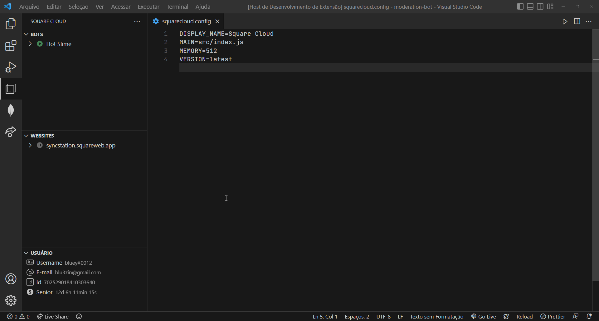
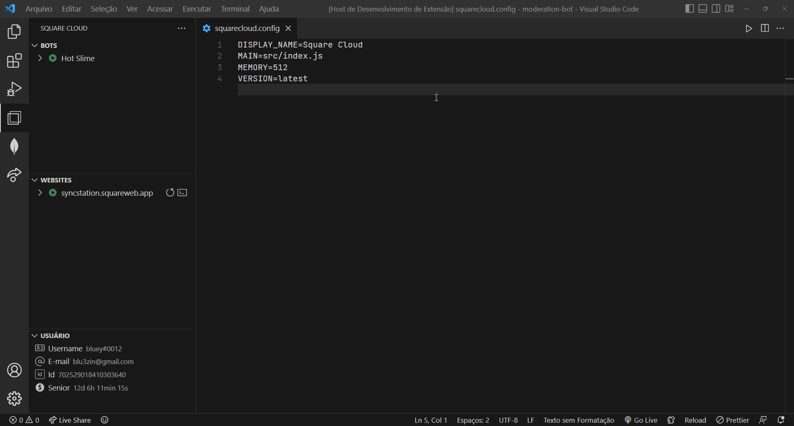
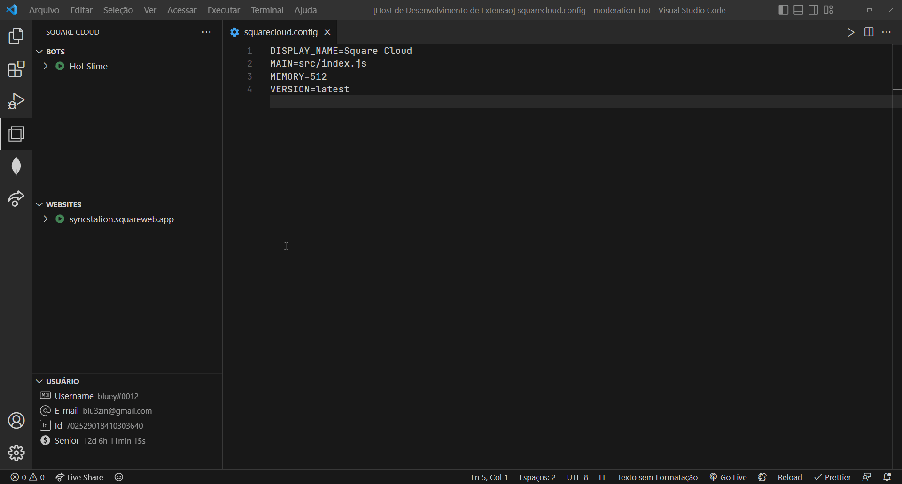
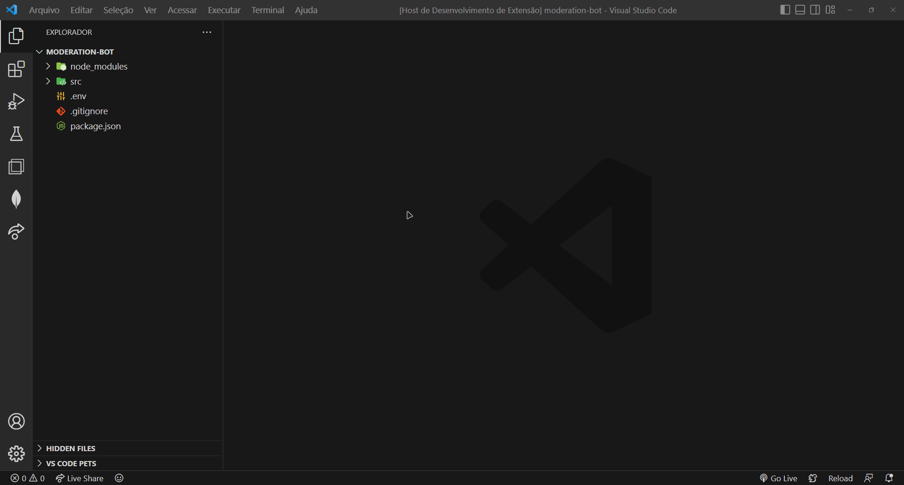

# **Square Cloud** está no VS Code!

Essa extensão pode gerenciar e receber informações de todas as suas aplicações hospedadas na [Square Cloud](https://squarecloud.app/).

### **Requisitos**

- Para utilizar a extensão em sua melhor versão você precisa de uma **chave de API**.
  - Para isso faça login no site oficial e resgate sua chave [aqui](https://squarecloud.app/dashboard/me/).

---

## **Aplicações**

### **Iniciar, parar e reiniciar**

### **Realizando commit**

- **Importante!** Envie a pasta de sua aplicação (sem estar compactada) e utilize o arquivo `squarecloud.ignore` para não enviar arquivos indesejados.

### **Verificando status & logs**

_\* Ícones acessíveis._

- 🟢 **Ícone verde:** aplicação online.
- ⚪ **Ícone cinza:** aplicação offline.

## **Outras funções**

### **Criando arquivo de configuração**

---

### **Configurações da extensão**

Esta extensão vai contar com apenas uma configuração:

- `squarecloud.apiKey`: Sua chave de API da Square Cloud.

---

## _Feito com ❤️ por [bluey#0012](https://github.com/bluee-js/)_
