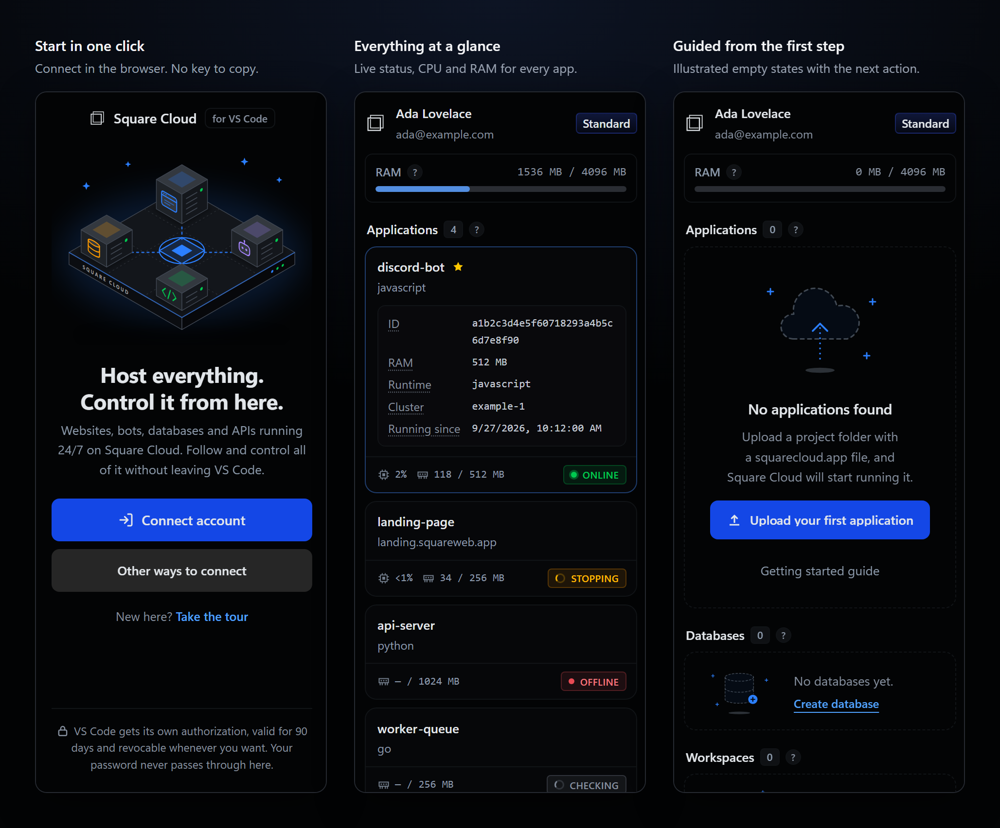
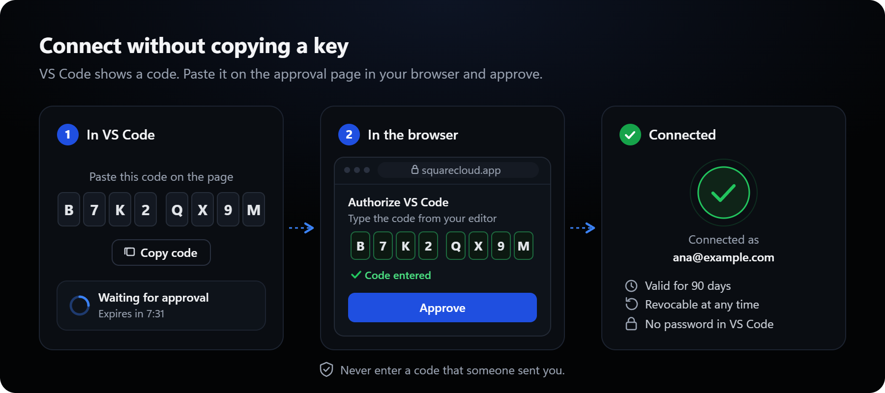
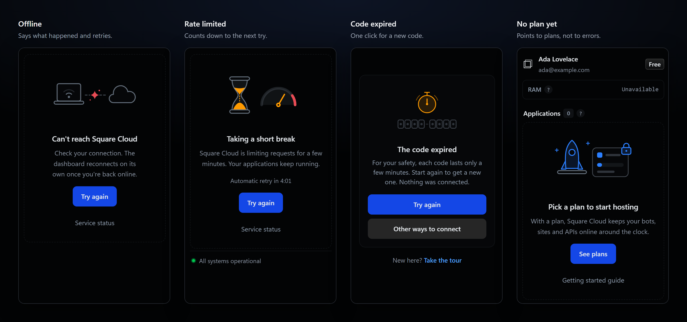
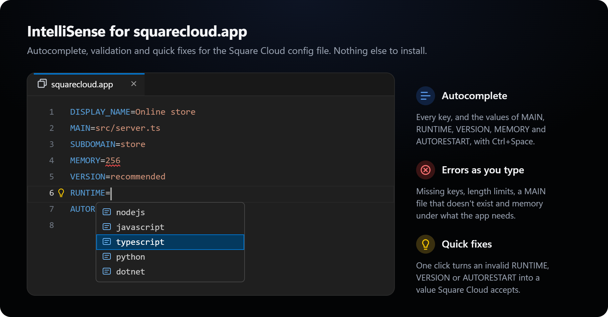

<div align="center">
  
</div>

<h1 align="center">Square Cloud for VS Code</h1>

<p align="center">
  Deploy, manage and monitor your <a href="https://squarecloud.app" target="_blank">Square Cloud</a> applications, databases and workspaces without leaving the editor.
</p>

<p align="center">
  <a href="https://marketplace.visualstudio.com/items?itemName=squarecloud.squarecloud"></a>
  <a href="https://open-vsx.org/extension/squarecloud/squarecloud"></a>
  <a href="https://github.com/squarecloudofc/vscode-extension/blob/main/LICENSE"></a>
</p>

<p align="center">
  
</p>

## Highlights

- **Connect in the browser.** Approve with an eight-character code. No key to copy or paste.
- **Every application at a glance.** Live status, CPU and RAM, one-click start, stop, restart and logs, and a filter with pages once the list grows past 10.
- **Deploy from the editor.** Upload a new application or commit to an existing one, with your ignore rules applied.
- **The whole toolbox.** Realtime logs, 24h metrics, snapshots, environment variables, GitHub deploys, edge analytics, databases and workspaces.
- **A config file that checks itself.** Autocomplete, validation and quick fixes for `squarecloud.app`.
- **Calm when things go wrong.** Being offline, a rate limit or an outage each get a clear, illustrated state that retries on its own.

---

## Table of contents

- [Getting started](#getting-started)
  - [Get Started walkthrough](#get-started-walkthrough)
- [Deploying from VS Code](#deploying-from-vs-code)
  - [Upload a new application](#upload-a-new-application)
  - [Commit changes to an existing application](#commit-changes-to-an-existing-application)
  - [Ignore rules](#ignore-rules)
- [Managing applications](#managing-applications)
  - [Lifecycle & status](#lifecycle--status)
  - [Logs](#logs)
  - [Realtime stream](#realtime-stream)
  - [Metrics](#metrics)
  - [Snapshots](#snapshots)
  - [Environment variables](#environment-variables)
  - [GitHub App integration](#github-app-integration)
  - [Edge network tools](#edge-network-tools-website-applications)
- [Databases](#databases)
- [Workspaces](#workspaces)
- [Service status, problems & status bar](#service-status-problems--status-bar)
- [Configuration file IntelliSense](#configuration-file-intellisense)
- [Command reference](#command-reference)
- [Settings](#settings)
- [Localisation](#localisation)
- [Activation & performance](#activation--performance)
- [Rate limits](#rate-limits)
- [Security & privacy](#security--privacy)
- [Requirements](#requirements)
- [Troubleshooting](#troubleshooting)
- [Contributing](#contributing)
- [License](#license)

---

## Getting started

1. Install **Square Cloud** from the [VS Marketplace](https://marketplace.visualstudio.com/items?itemName=squarecloud.squarecloud) or [Open VSX](https://open-vsx.org/extension/squarecloud/squarecloud).
2. Click the **Square Cloud** icon in the activity bar and press **Connect account**, or run `Square Cloud: Connect Account` from the command palette (`Ctrl+Shift+P` / `Cmd+Shift+P`).
3. Approve in the browser. The side bar shows an eight-character code and copies it to your clipboard; paste it on the approval page and approve. **Never enter a code that someone sent you:** it would connect their editor to your account.
4. Done. The side bar confirms which account you connected, then loads your applications, databases and workspaces.

<p align="center">
  
</p>

VS Code gets an authorization of its own: scoped to what the extension uses, valid for **90 days**, and revocable at any time under **My Account → Authentication** in the dashboard. Your account's master key never enters the editor.

**Other ways to connect** takes a token created by hand in the dashboard, for a machine without a browser for instance. Either way the secret is stored in the OS keychain through VS Code's `SecretStorage`, never in plain text on disk. A legacy `auth.json` from an older version is migrated automatically on first run.

### Get Started walkthrough

New to Square Cloud? `Square Cloud: Get Started` opens a guided walkthrough on VS Code's Welcome page, in every language the extension speaks. On the extension's first activation it opens by itself if no account is connected, and never again after that. It is also linked from the sign-in view, the side bar and the `...` menu of the Square Cloud view.

Each step explains one idea in plain words, with an animated illustration that follows your theme and buttons that run the real command:

1. **Connect your account:** the browser approval and the eight-character code check.
2. **Describe your app in `squarecloud.app`:** what the config file is for, and the autocomplete, validation and quick fixes this extension adds to it.
3. **Upload your application:** Upload for a new application, Commit for an existing one.
4. **Start, stop and restart:** the side bar, status badges and the action menu, including environment variables.
5. **Follow logs and metrics:** logs, the realtime stream and 24h metrics.
6. **Back up with snapshots:** download a snapshot and restore one.
7. **Create a database:** managed databases and their TLS certificate.
8. **Work as a team:** workspaces and invite codes.
9. **Deploy on every git push:** linking the GitHub App to a repository and branch.
10. **Understand your traffic:** edge logs, performance and cache purge for websites.

Steps tick themselves off as you do them (connecting, uploading, opening logs, ...). Commands that act on one application or database ask which one when run from the walkthrough, and ask you to connect first if you haven't.

---

## Deploying from VS Code

### Upload a new application

Run `Square Cloud: Upload New Application` from the command palette, the upload icon in the side bar's title bar, or **Upload your first application** on an empty account.

1. **Pick a folder.** Your open workspace folders come first (the common case: deploy the project you're editing), and **Browse...** picks any other folder.
2. **Check the config.** The folder must contain a [`squarecloud.app` or `squarecloud.config`](https://docs.squarecloud.app/getting-started/config-file) file. Without one you get an error with a link to the documentation, and nothing is uploaded.
3. **Confirm.** A dialog asks before anything leaves your machine.
4. **Zip, with your ignore rules.** Files matching the defaults and your `squarecloud.ignore` are left out, see [Ignore rules](#ignore-rules). The folder is zipped in memory with a live file count, and you can cancel until the upload starts. Zips are limited to 100 MB, checked before sending.
5. **Done.** The notification shows the detected runtime and offers **Open dashboard** and **Copy ID**. The side bar refreshes on its own.

If the config file declares a `SUBDOMAIN`, the application answers at `https://<subdomain>.squareweb.app` once it starts.

### Commit changes to an existing application

Open an application's action menu (right-click its card, or its ⋯ button) and pick **Commit**. Choose whether to restart the application afterwards, then pick one or more files, or a folder. A folder is zipped with the same ignore rules and lands inside a folder of the same name in the application. The status refreshes on its own either way.

**Upload or Commit?** *Upload* creates a new application (new ID, new plan slot). *Commit* sends files to an application that already exists and keeps its ID, domain and configuration.

### Ignore rules

When zipping, exclusions come from:

1. **Built-in defaults:** `node_modules`, `.git`, `.github`, `.vscode` and the lockfiles `package-lock.json`, `pnpm-lock.yaml` and `yarn.lock`. A `!` rule in your file brings one back, for example `!yarn.lock`.
2. **`squarecloud.ignore`** at the root of the folder, if there is one, with the same syntax as `.gitignore`.

Your `.gitignore` is not read: it often lists what the application needs to run, like `.env` or build output. Copy the lines you want into `squarecloud.ignore`.

The Square Cloud CLI reads the same `squarecloud.ignore` with the same defaults, so both upload the same files. List build output and caches in it. A symbolic link to a file is uploaded as that file; links to folders and broken links are skipped. If everything in the folder ends up ignored, the upload stops with an "empty folder" error instead of sending an empty zip.

---

## Managing applications

The side bar opens with your account: name, plan and a RAM meter for the plan's memory. Below it, every application is a card with a live status badge (**Online**, **Offline**, **Checking** while the status loads, or amber while a start, stop or restart you clicked is on its way), its RAM and, while it runs, its CPU. Click a card to see its ID, memory, runtime, cluster, domain and when it started; an open card keeps that up to date on every refresh, even after a restart made elsewhere.

Pointing at a card shows start or stop, restart and logs, and the star next to the name marks a favourite and keeps it at the top. **Right-click a card, or use its ⋯ button, for the full action menu**, grouped by purpose, with destructive actions last.

Past 10 applications the list shows 10 at a time with previous and next arrows, and a filter by name, domain or ID finds one among hundreds.

Actions that can't work are not offered at all: edge analytics only appear for applications with a domain, and metrics only for applications with 512 MB or more.

### Lifecycle & status

**Start**, **Stop** and **Restart** from the card or the action menu. After each action the extension follows the status until it changes, checking at 600 ms, 1.8 s and 4 s and stopping as soon as it flips, so a stopped application reads as stopped almost at once. Statuses for all applications refresh in the background, see [Activation & performance](#activation--performance).

### Logs

**Show logs** fetches the latest logs into an output channel of their own for each application, with ANSI colours preserved. Logs are fetched only when you ask; nothing streams in the background.

### Realtime stream

**Toggle realtime stream** opens a live feed of your application in an output channel. Run the same command again to stop it.

- The platform allows up to **5 concurrent streams** per account. Past that, the refusal shows as a clear message instead of failing silently.
- Each connection lives about 10 minutes on the server. When it closes, the extension **reconnects on its own** after a short pause and marks it with `[Reconnecting...]` in the channel. Stopping the stream yourself never reconnects, and a stream that is refused or drops right away is not retried in a loop.
- The stream mixes log lines with resource metrics several times a second. Only your application's own output is printed.
- Every stream closes cleanly when the extension shuts down.

### Metrics

**Show 24h metrics** prints the last 24 hours of CPU, RAM and network in 5-minute samples, plus the latest sample and the 24-hour averages, to an output channel. It needs an application with at least 512 MB of RAM.

### Snapshots

- **Download snapshot** generates a fresh snapshot and saves the zip (`snapshot-<id>.zip`) to the folder you choose. A large application can take a couple of minutes to generate one; the extension says so, and running **Download snapshot** again then saves it.
- **Restore snapshot** lists stored snapshots, newest first with their size, and restores the one you pick after a confirmation.
- **Delete** asks you to type the application's name, then takes a recovery snapshot before deleting and offers **Download snapshot**, which opens it in the browser. A mistaken delete is never fatal. If that snapshot is still being generated, nothing is deleted and you are asked to try again in a couple of minutes.

Snapshots are limited per plan per day. Reaching the limit says so, with a **See plans** button.

### Environment variables

**Environment variables** opens a manager in a Quick Pick: list every variable, add one (the key format is checked), edit a value, delete one, or clear them all after a confirmation. Changes apply right away.

### GitHub App integration

**Link GitHub repository** connects a repository (`owner/repo` and a branch, `main` by default) for automatic deploys on every push. **Unlink** removes the link after a confirmation. It needs the [Square Cloud GitHub App](https://docs.squarecloud.app) installed on your GitHub account.

### Edge network tools (website applications)

For applications with a domain, the action menu adds the edge tools:

- **Edge logs**, **Edge errors** and **Edge performance:** pick a range (1 hour, 6 hours, 24 hours or 7 days) and the report opens in an output channel.
- **Purge edge cache:** clears the whole edge cache after a confirmation.

Applications without a domain get a friendly "no domain" message instead of an API error.

---

## Databases

The **Databases** section lists your managed databases with engine and memory. Right-click one, or use its ⋯ button, for **Start**, **Stop**, **Download TLS certificate** (saved as `.pem`, plus `.crt` and `.key` when present) and **Delete** (type the name to confirm).

**Create database** is in the side bar's `...` menu, the command palette and the empty Databases section:

1. Give it a name, an engine (`mongo`, `mysql`, `redis` or `postgres`), its memory in MB (256 or more) and a version. The version picker suggests current versions, and **Other version...** takes any value.
2. As soon as the database exists, its connection URL, password included, is copied to your clipboard, and a **Copy password** button is offered. **Square Cloud shows these credentials only once**, so keep them somewhere safe.

Databases need a paid plan. Without one, the extension says so with a **See plans** button.

---

## Workspaces

The **Workspaces** section shows every workspace you own or joined, with its member and application counts. Right-click one, or use its ⋯ button, for:

- **Leave workspace.**
- **Delete workspace:** type the name to confirm. Square Cloud only allows it for the owner.

**Create workspace** is in the side bar's `...` menu, the command palette and the empty Workspaces section.

To join someone else's workspace, use **Copy My Invite Code** in the same `...` menu (or the command palette). It copies your personal invite code, valid for 5 minutes; send it to the workspace owner, who uses it to add you.

---

## Service status, problems & status bar

- Platform health sits in the **footer of the side bar**, always visible, green when everything is operational. When Square Cloud reports trouble, a banner at the top of the side bar shows its message and a link to the [status page](https://status.squarecloud.app/).
- **Every problem has its own illustrated state** instead of a blank panel: no connection, a rate-limit pause with a countdown to the automatic retry, maintenance, an authorization that needs connecting again, an unexpected error, and an account without a plan, which points to the plans rather than to an error. Each one says what happened and offers the action that helps: **Try again**, **Connect account**, **Service status** or **See plans**. If a refresh fails while your data is already on screen, a small banner says so and keeps showing the last data it loaded, with the time.
- Empty **Databases** and **Workspaces** sections show a short explanation and a **Create** shortcut.
- Error notifications carry the one button that helps with that kind of problem: **Connect account** when the authorization is no longer valid, **See plans** for plan limits, **Service status** for rate limits and outages.
- A **status bar item** shows at a glance whether an account is connected, how many applications are online out of the total, and whether Square Cloud is offline, pausing requests or degraded. Hover it for the account, plan and service status, with links to refresh, see the service status and open the dashboard. Click it to refresh, or to connect when no account is connected.

<p align="center">
  
</p>

---

## Configuration file IntelliSense

`squarecloud.app` and `squarecloud.config` get full editor support, with no JSON schema or language server to install.

<p align="center">
  
</p>

### Validation as you type

Every problem is underlined as an error:

- Missing required keys (`MAIN`, `VERSION`, `MEMORY`, `DISPLAY_NAME`), and duplicate keys on their second occurrence.
- Lengths: `DISPLAY_NAME` up to 32 characters, `DESCRIPTION` up to 280, `START` up to 256 and `SUBDOMAIN` up to 63.
- `MAIN` must exist in the project, and is flagged when it sits outside it or inside `node_modules`, `__pycache__` or a dot-folder. It becomes optional once `START` is set, as in the docs.
- `MEMORY` needs at least 256 MB, or 512 MB with a `SUBDOMAIN` (a website), and no more than your plan has free. That last one comes with an **Upgrade** link.
- `SUBDOMAIN` accepts only letters, numbers and hyphens.
- `RUNTIME` accepts the 17 aliases from the docs: `nodejs`, `javascript`, `typescript`, `python`, `dotnet`, `csharp`, `c#`, `java`, `elixir`, `rust`, `php`, `go`, `golang`, `ruby`, `rb`, `static` and `html`.
- `VERSION` accepts `recommended` or `latest`.

### Autocomplete

- On an empty line, every key, with the required ones first.
- After `=`:
  - `MAIN=` lists the source files in the workspace, skipping `dist`, `node_modules`, `__pycache__` and dot-folders.
  - `RUNTIME=` lists every runtime alias.
  - `VERSION=` offers `recommended` and `latest`.
  - `AUTORESTART=` offers `true` and `false`.
  - `MEMORY=` offers sizes from 256 MB to 32 GB, without the ones under 512 MB once `SUBDOMAIN` is declared.

### Quick fixes

The light bulb on an `AUTORESTART`, `VERSION` or `RUNTIME` line sets a valid value in one click (for `RUNTIME`, one of the canonical runtime names).

### Syntax highlighting & file icons

File icons for `squarecloud.app`, `squarecloud.config` and `squarecloud.ignore`, and a TextMate grammar that colours keys and values.

---

## Command reference

Commands in the palette, all under **Square Cloud:**

| Command | ID | Where |
|---|---|---|
| Connect Account | `squarecloud.setApiKey` | Command palette, sign-in view, status bar (when signed out) |
| Get Started | `squarecloud.getStarted` | Command palette, sign-in view, side bar, `...` menus |
| Refresh | `squarecloud.refreshCache` | Command palette, side bar title bar, status bar |
| Upload New Application | `squarecloud.uploadApplication` | Command palette, side bar title bar, empty Applications section |
| Show Service Status | `squarecloud.showServiceStatus` | Command palette and side bar footer, with an account connected |
| Create Database | `squarecloud.createDatabase` | Command palette, side bar `...` menu, empty Databases section |
| Create Workspace | `squarecloud.createWorkspace` | Command palette, side bar `...` menu, empty Workspaces section |
| Copy My Invite Code | `squarecloud.generateInviteCode` | Command palette, side bar `...` menu |
| Disconnect Account | `squarecloud.logout` | Command palette, side bar `...` menu |

With an account connected, the palette also runs the application and database actions. Each one asks which application or database to use, and lists only the ones it applies to: Start offers applications that aren't running, Stop and Restart the ones that aren't stopped, the edge tools only websites, and metrics only applications with 512 MB or more.

| Group | Palette commands |
|---|---|
| Lifecycle | Start Application..., Stop Application..., Restart Application... |
| Logs & metrics | Show Application Logs..., Toggle Application Realtime Stream..., Show 24h Application Metrics... |
| Deploy | Commit Files to Application..., Download Application Snapshot..., Restore Application Snapshot... |
| Settings | Edit Application Environment Variables..., Link Application to GitHub Repository..., Unlink Application from GitHub Repository... |
| Edge (websites) | Show Edge Logs..., Show Edge Errors..., Show Edge Performance..., Purge Edge Cache... |
| Other | Open Application in Web Dashboard..., Copy Application ID..., Delete Application... |
| Databases | Start Database..., Stop Database..., Download Database TLS Certificate..., Delete Database... |

The action menu of an **application** (right-click its card, or its ⋯ button):

| Group | Actions |
|---|---|
| Application | Start or Stop, Restart (while running), Open in dashboard, Show logs, Copy ID, Favorite / Unfavorite |
| Deploy | Commit, Download snapshot, Restore snapshot |
| Configuration | Environment variables, Link GitHub repository, Unlink GitHub repository |
| Monitoring | Toggle realtime stream |
| Metrics | Show 24h metrics (512 MB or more) |
| Edge | Edge logs, Edge errors, Edge performance, Purge edge cache (applications with a domain) |
| Danger zone | Delete (with an automatic recovery snapshot) |

The action menu of a **database**: Start, Stop, Download TLS certificate, Delete.
The action menu of a **workspace**: Leave, Delete.

---

## Settings

| Setting | Default | Description |
|---|---|---|
| `squarecloud.favApps` | `[]` | IDs of your favourite applications. The star on each card manages it, so you rarely need to edit it by hand. |

---

## Localisation

Available in the eight languages of the Square Cloud website: **English**, **Português (Brasil)**, **Español**, **Deutsch**, **Français**, **Italiano**, **日本語** and **简体中文**. That covers almost every command, prompt, notification and error message, and links into the website open in the same language. VS Code picks the language from its own display language.

---

## Activation & performance

The extension activates only when needed: when a `squarecloud.app` or `squarecloud.config` file exists in the workspace, or when you open the Square Cloud side bar, run one of its commands or open a config file. Until then there is no background activity at all, and no startup cost for unrelated windows.

Once active:

- The account refreshes every **60 seconds**: user, application statuses and workspaces, fetched in parallel.
- Polling **pauses while the VS Code window is out of focus** and resumes, with an immediate refresh, when you come back, so an idle editor doesn't spend your API quota.
- Refreshes that overlap are merged: a second trigger waits for the one already running instead of starting another.
- Polling also stops while your account has no applications; a manual refresh still works.

---

## Rate limits

The extension stays inside the platform's request budgets and degrades politely when a limit is hit:

- A short `KEEP_CALM` burst on a single application's status check (after an action, or when you open a card) is retried once after 10 seconds. A `RATE_LIMITED` block, which can last up to about 30 minutes, pauses background polling for a few minutes and keeps the last known state on screen; the side bar shows the pause and retries by itself when it ends. Actions you start show a clear message and are never retried in a loop.
- Realtime streams reconnect at a measured pace after the server closes them, and refusals (including the cap of 5 streams per account) stop the stream with a message instead of retrying.
- Logs are fetched only when you ask; nothing polls them in the background.

---

## Security & privacy

- Connecting grants an authorization scoped to what the extension calls, valid for 90 days and revocable in the dashboard. Your account's master key never enters the editor.
- The approval code is shown in the editor and typed on the page. It never travels in a URL, so seeing the link is not enough to approve on your behalf.
- Connecting or disconnecting in one VS Code window applies to every open window.
- The credential lives in VS Code's `SecretStorage`, backed by the OS keychain (Windows Credential Manager, macOS Keychain, libsecret). It is never written to settings, global state or disk.
- When a database is created, its connection URL is copied to your clipboard once, and the password only through **Copy password**. The extension never stores either.
- The extension talks only to Square Cloud: through the official [`@squarecloud/api`](https://github.com/squarecloudofc/sdk-api-js) SDK, plus the sign-in handshake, which uses a local loopback address. No telemetry, no third-party services.

---

## Requirements

- **VS Code 1.125** or newer.
- **A Square Cloud account.**
- Some features (databases, workspaces, edge analytics, GitHub App linking, the snapshot list) need a paid plan. The extension says so clearly when your plan doesn't allow an action.

---

## Troubleshooting

**Nothing shows up in the side bar.**
Check that an account is connected: without one, the side bar shows the sign-in screen instead of your applications. If Square Cloud can't be reached, is pausing requests or is under maintenance, the side bar says which, with **Try again** and **Service status** buttons.

**"Your authorization expired or was revoked."**
Authorizations last 90 days and can't be renewed silently. Run `Square Cloud: Connect Account` again. You can revoke one at any time under **My Account → Authentication** in the dashboard.

**Someone sent you a link or a code to approve.**
Don't enter it. A code belongs on the approval page only when your own VS Code shows it; approving someone else's code would connect their editor to your account. If the page rejects the code you pasted, start over from VS Code.

**Upload fails with a missing config error.**
The chosen folder needs a `squarecloud.app` or `squarecloud.config` at its root. The error links to the [config file documentation](https://docs.squarecloud.app/getting-started/config-file), and the extension checks the file as you write it.

**Upload fails because the zip is too large.**
Zips are capped at 100 MB. Add build output, caches and dependency folders to `squarecloud.ignore` (`node_modules` and `.git` are already left out). Dependencies are installed on the platform from your manifest, so they don't need to be uploaded.

**A command failed with a rate-limit message.**
A "too many requests" burst clears in a few seconds. A rate-limit block can last up to about 30 minutes. Background polling already backs off on its own, and retrying over and over only extends it.

**Diagnosing anything else.**
Open `View → Output` and pick the **Square Cloud** channel for structured logs (info, warn, error) of every API call, and include them when you report a bug. Notifications explain the common error codes; rarer ones fall back to a generic message with the raw code, and the full detail is always in the output channel.

**Stale data.**
Click the status bar item or the refresh icon in the side bar's title bar to refresh now. Remember that polling pauses while the window is out of focus.

---

## Contributing

Issues, suggestions and pull requests are welcome in the [GitHub repository](https://github.com/squarecloudofc/vscode-extension). See [`CONTRIBUTING.md`](./CONTRIBUTING.md) for setup, lint and build instructions.

```bash
git clone https://github.com/squarecloudofc/vscode-extension
cd vscode-extension
pnpm install
pnpm watch     # incremental build + typecheck
# press F5 in VS Code to launch the Extension Development Host
```

---

## License

MIT. See [`LICENSE`](./LICENSE).
